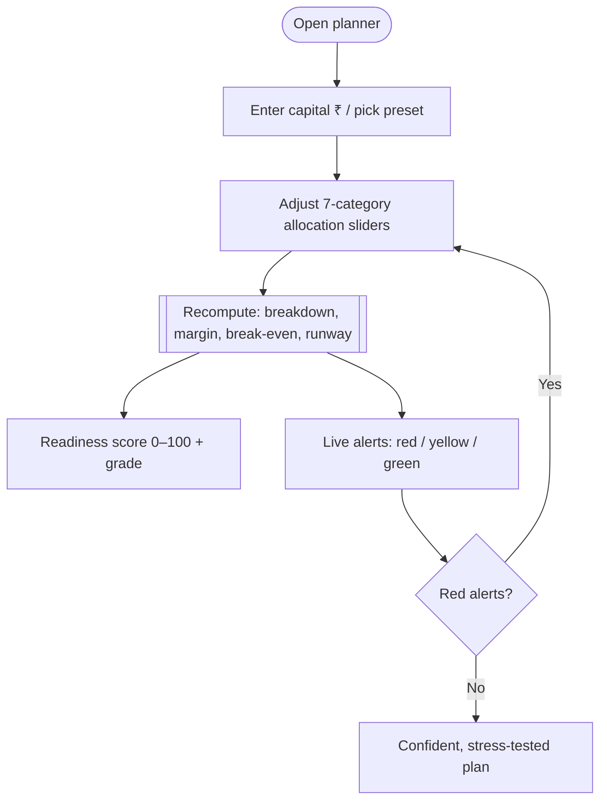
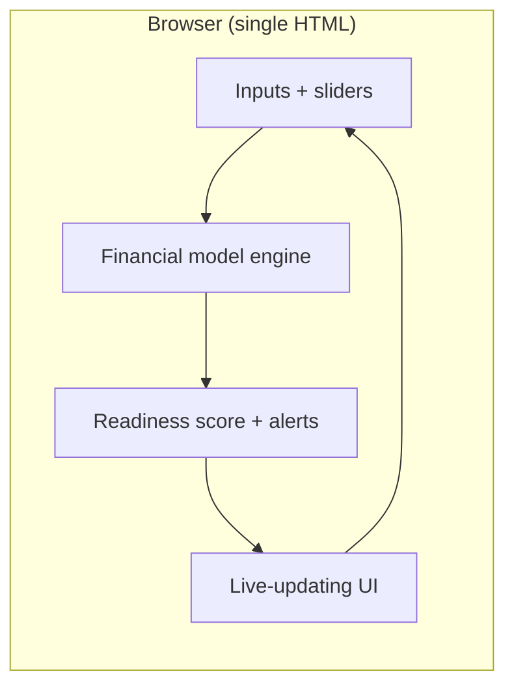
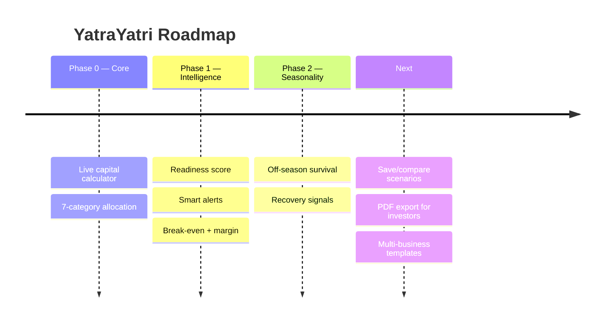
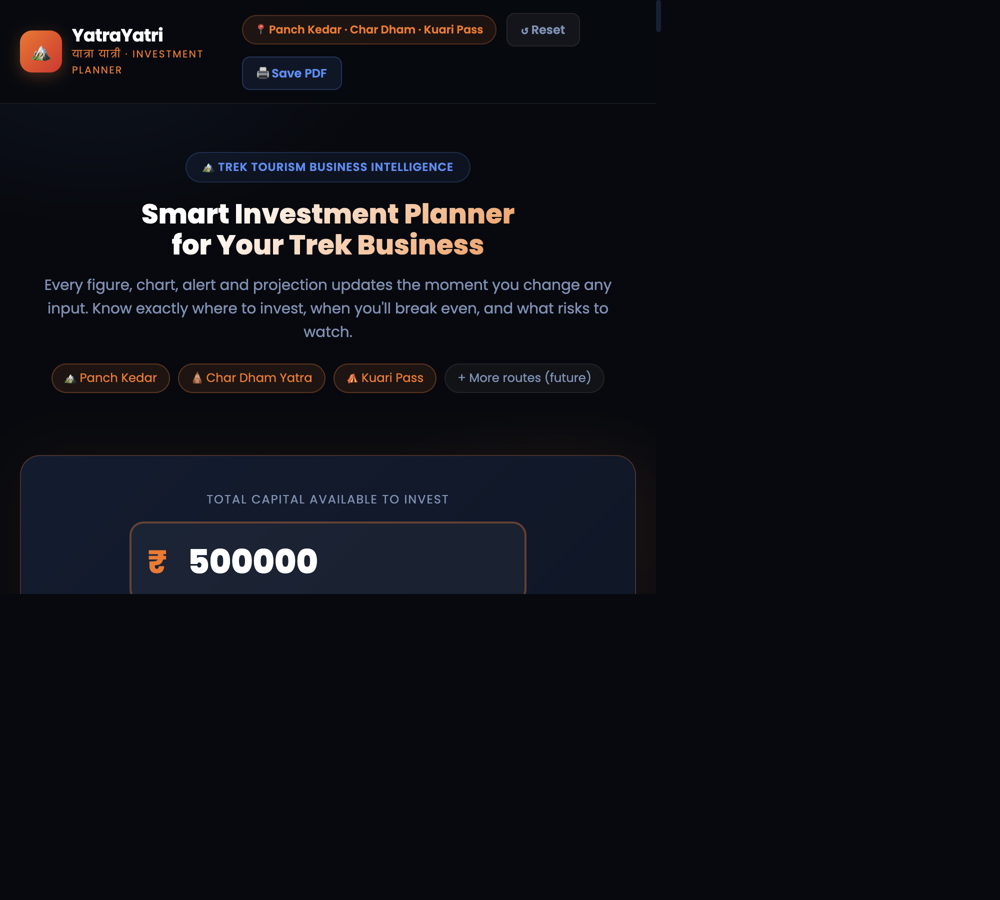

# YatraYatri — Product Requirements Document & Case Study

> **Turn "I have money to invest but don't know how" into a clear plan.** An interactive financial-planning tool for trek-tourism entrepreneurs.

| | |
|---|---|
| **Live app** | https://aastha381.github.io/yatrayatri-planner/ |
| **Repository** | https://github.com/AASTHA381/yatrayatri-planner |
| **Author** | Aastha Saini |
| **Client** | YatraYatri — Himalayan trek travel business |
| **Type** | 0→1 B2B / SMB decision-support tool |
| **Doc version** | 1.0 |

---

## 1. TL;DR (Loom-style walkthrough script)

> *This is the YatraYatri Business Investment Planner. It was built for a real client — a Himalayan trek-tourism founder who told me: "I have money to invest in my business but I don't know how to invest it, what to consider, how many people to hire."*
>
> *So instead of a static spreadsheet, I built a live planner. You enter your capital and every number on the page updates instantly — a 7-category allocation with sliders, a 0–100 business-readiness score, and a live alerts panel that flags things like "emergency fund too low" or "HR runway critical" in real time. It turns an overwhelming set of financial decisions into a guided, visual, self-serve plan — and it's tailored to the realities of seasonal trek tourism, like surviving the off-season.*

**Elevator pitch:** *A live financial cockpit that tells an SMB founder exactly how to split and stress-test their capital.*

---

## 2. Problem Statement

Early SMB founders (here, trek tourism) have capital but **lack a framework** to allocate and stress-test it — leading to under-funded essentials, thin margins, and no off-season survival plan.

**The core problem (client's own words):**
> *"I have money to invest in my business but don't know how to invest it — what factors to consider, how to take care of finances, how many people to hire."*

**Signals:**
- Dozens of interdependent decisions (allocation, hiring, break-even, off-season).
- Generic budgeting tools don't model a seasonal trek business.
- Founders need *guidance*, not a blank spreadsheet.

**Hypothesis:**
> If a founder can adjust capital and allocations and instantly see readiness, risks and break-even, they'll make safer, more confident investment decisions.

---

## 3. Research

### 3.1 Method
- **Client discovery** — direct problem framing from the founder.
- **Domain modelling** — trek-tourism cost structure (operations, HR, marketing, legal, emergency fund…) and seasonality.

### 3.2 Insights
| # | Insight | Implication |
|---|---------|-------------|
| 1 | Founders freeze at "how do I split it?" | **7-category allocation** with live ₹ breakdown. |
| 2 | Numbers feel abstract until they move. | **Everything updates instantly** as you drag. |
| 3 | Risk is invisible until it's too late. | **Live alerts** (emergency fund, HR runway…). |
| 4 | They want a single "am I ready?" signal. | **0–100 readiness score** with grade. |
| 5 | Seasonality (off-season) is existential. | Model **break-even + off-season survival**. |

### 3.3 Competitive landscape
| Alternative | Reality | Gap YatraYatri fills |
|---|---|---|
| Blank spreadsheet | No guidance, error-prone | Guided, live, domain-specific |
| Generic budgeting apps | Not modelled for trek tourism | Seasonal, category-specific |
| Hiring an advisor | Costly for a small founder | Free, self-serve, instant |

---

## 4. User Personas

### Primary — "First-time founder Farhan" 🎯
| Attribute | Detail |
|---|---|
| Who | Trek-tourism entrepreneur with starting capital |
| Pain | Doesn't know how to allocate or stress-test money |
| Goal | A safe, confident investment plan |
| Wins | Live allocation + readiness score + risk alerts |

### Anti-persona
Established businesses with a finance team/CFO.

---

## 5. Goals & Success Metrics

### North Star Metric
> **Founders who reach a "ready" plan** (readiness score in a healthy band with no red alerts).

### Supporting metrics (proposed)
| Category | Metric | Target |
|---|---|---|
| Activation | % who adjust ≥1 allocation | ≥ 70% |
| Value | % reaching "Good/Excellent" readiness | trending up |
| Risk avoidance | % who resolve red alerts | ≥ 60% |
| Engagement | Scenarios tried per session | ≥ 3 |

### Guardrails
- Financial math is internally consistent; alerts are actionable, not noisy.

---

## 6. Solution & MVP Scope

**Solution:** A single-page, live financial planner that converts a capital amount into an allocated, risk-checked, break-even-aware business plan for a seasonal trek business.

### MVP (shipped)
| Capability | Description |
|---|---|
| 💰 **Live investment calculator** | Enter ₹1L–₹50L; whole page updates instantly (+ presets) |
| 💯 **Business readiness score** | 0–100 with grade + "what's dragging it down" tips |
| 🚨 **Smart alerts panel** | Red/yellow/green alerts on emergency fund, HR runway, margin, legal… |
| 🎯 **7-category allocation** | Draggable sliders with live ₹ breakdown |
| 📉 **Break-even & margin** | Modelled from inputs |
| ❄️ **Off-season survival** | Runway/recovery signals |

### Out of scope
- Multi-business support, saved scenarios/accounts, bank/accounting integrations.

---

## 7. User Flow (Flowchart)



---

## 8. System Architecture



**Key decisions**
- **Fully client-side, reactive** — every input recomputes the whole model instantly; no server needed.
- **Domain-specific model** (trek tourism + seasonality) rather than a generic budget.
- **Alerts as guardrails** — translate raw numbers into plain-language risks.

---

## 9. Wireframe (low-fidelity)

```
┌─────────────────────────────────────┐
│ 🏔️ YatraYatri Investment Planner     │
│ Capital: [ ₹5,00,000 ]  presets…    │
├──────────────┬──────────────────────┤
│ Readiness 78 │ 🚨 Alerts            │
│  (Good)      │  🔴 Emergency fund low│
│              │  🟡 Thin margin       │
├──────────────┴──────────────────────┤
│ 🚌 Operations  ▓▓▓▓▓░  ₹1,50,000     │
│ 👥 HR          ▓▓▓░░░  ₹90,000       │
│ 📣 Marketing   ▓▓░░░░  ₹60,000       │
└─────────────────────────────────────┘
```

Shipped UI in **Section 11**.

---

## 10. Roadmap



---

## 11. Screenshots

### Live investment planner


---

## 12. Key Decisions & Trade-offs

| Decision | Options | Choice & why |
|---|---|---|
| **Static vs live** | Spreadsheet vs reactive app | **Live** — instant feedback drives exploration. |
| **Generic vs domain** | Generic budget vs trek-specific | **Domain-specific** — matches the client's real costs. |
| **Numbers vs guidance** | Raw figures vs alerts | **Alerts + score** — turns data into decisions. |

---

## 13. What I'd do next
1. **Save & compare scenarios**. *(decision confidence)*
2. **Investor-ready PDF export**. *(fundraising utility)*
3. **Templates for other SMB types**. *(reach)*

---

## 14. Appendix — Tech
- Single-file reactive web app (vanilla JS), client-side financial model, GitHub Pages. Built for a real client (YatraYatri).
